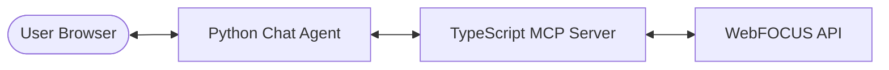

# WebFOCUS MCP Agent

This repository contains a full-stack AI agent ecosystem for interacting with the IBI WebFOCUS (Oslo) API. It features a TypeScript-based MCP server and a Python-powered chat assistant with a modern web interface.

## System Architecture



### Components

1.  **[MCP Server](file:///Users/ramakuma/dev/git_ramanuj/test/RC_Agent/mcp-server)**: A TypeScript/Express server implementing the [Model Context Protocol (MCP)](https://modelcontextprotocol.io/). It handles authentication, CSRF tokens, and provides standardized tool interfaces for WebFOCUS resources.
2.  **[Chat Agent](file:///Users/ramakuma/dev/git_ramanuj/test/RC_Agent/agent)**: A Python application using Quart (ASGI) and LangChain. It provides a streaming chat REST API and a premium web-based GUI for interacting with the AI.

## Key Features

-   **Dynamic Tool Discovery**: The agent automatically discovers available tools from the MCP server at startup.
-   **WebFOCUS Integration**: Specialized tools for Domains, Workspaces, ReportCaster Status, Messaging Profiles, Access Lists, and Job Logs.
-   **Modern Chat UI**: 
    -   Streaming AI responses with Markdown support.
    -   Interactive Sidebar for suggested questions.
    -   **Request Cancellation**: A dedicated "Stop" button to abort ongoing requests.
    -   Premium dark-themed aesthetics with glassmorphism effects.
-   **Multi-LLM Support**: Configurable to use either **OpenAI** or **Ollama** (including gemma3, phi4, etc.).
-   **Reliable Fallbacks**: Intelligent rule-based routing handles tool execution if the primary LLM fails or doesn't support native tool calling.

## Getting Started

### Prerequisites

-   Docker and Docker Compose
-   OpenAI API Key (optional, if using OpenAI)
-   Local Ollama instance (optional, if using Ollama)

### Deployment

1.  **Clone the repository**:
    ```bash
    git clone https://github.com/ramanuj011/test.git
    cd test/RC_Agent
    ```

2.  **Configure Environment**:
    Edit `docker-compose.yml` to set your `OPENAI_API_KEY` or `OLLAMA_BASE_URL`.

3.  **Start the Services**:
    ```bash
    docker compose build
    docker compose up
    ```

4.  **Access the GUI**:
    Open [http://localhost:8082](http://localhost:8082) in your browser.

## Available Tools

The following tools are exposed by the MCP server:

| Tool | Description |
| :--- | :--- |
| `get_domains` | List all available WebFOCUS domains. |
| `get_myworkspace` | Retrieve user's workspace domains. |
| `get_rcaster_status` | Check ReportCaster health status. |
| `get_messaging_profiles` | List messaging profiles. |
| `get_feature_list` | Retrieve system feature flags. |
| `delete_job_logs` | Delete specific job logs by ID. |
| `calculate_sum` | Simple utility for arithmetic calculations. |

## Development

-   **MCP Server (TS)**: `npm install && npm run dev` inside `mcp-server/`.
-   **Agent (Python)**: `pip install -r requirements.txt && python mcp_agent.py` inside `agent/`.
